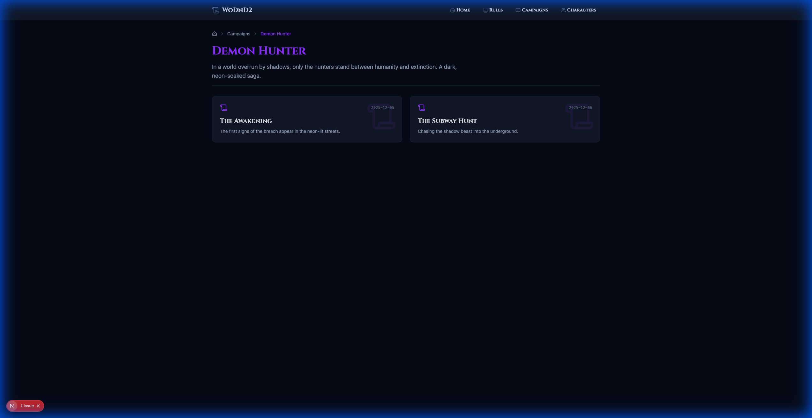
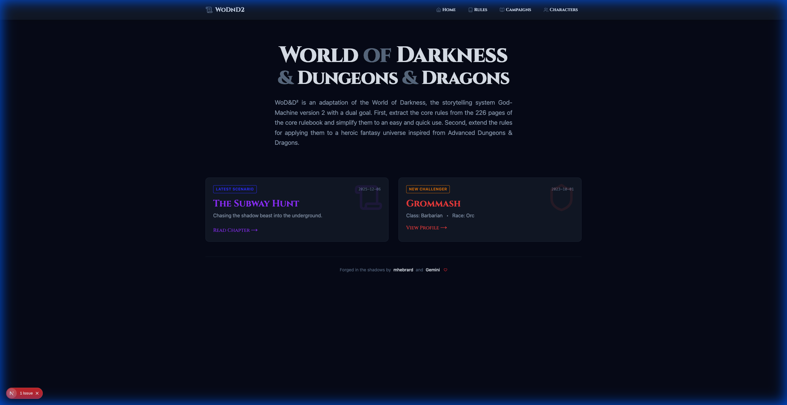
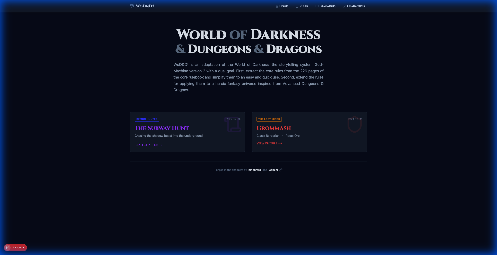
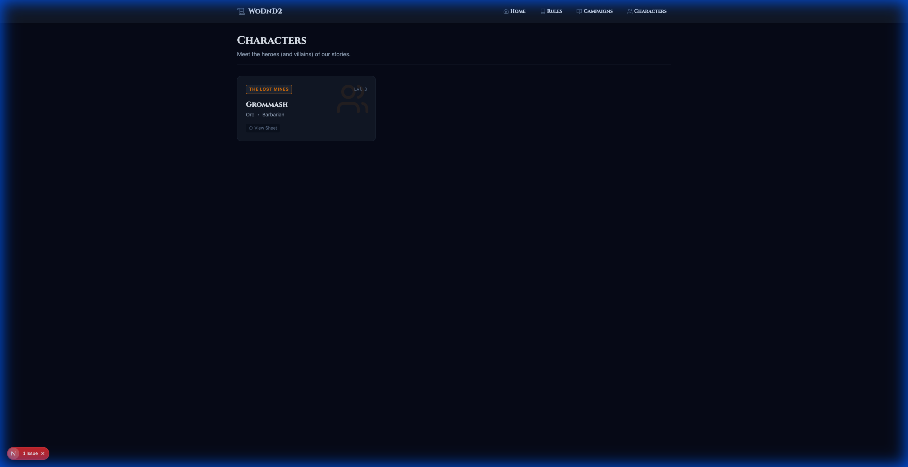
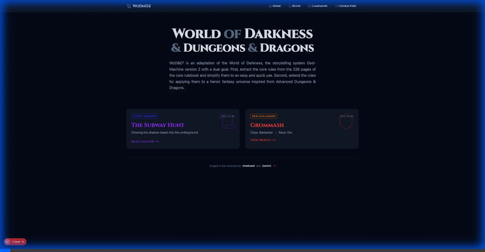

# Walkthrough - RPG Story Web App

I have successfully created the RPG Story Web App using Next.js and Tailwind CSS. The app is configured for static export, making it ready for deployment to GitHub Pages.

## Features Implemented

### 1. Home Page

- A premium landing page with a welcoming hero section.
- Quick links to Campaigns and Characters.
- Responsive layout with a dark, immersive theme.

### 2. Campaign Management

- **Campaign List**: Displays all available campaigns with descriptions and dates.
- **Visuals**: Cards feature a thematic "Open Book" watermark icon.
- **Story View**: Renders markdown content for each campaign.
- **Collapsible Sections**: Supported custom directives for Rules and HRP (Hors Roleplay) sections.
  - Usage in Markdown:

    ```markdown
    :::rules
    1. No metagaming.
    :::

    :::hrp
    Next session is on Tuesday.
    :::
    ```

### 3. Character Sheets

- **Character List**: Displays all characters with their class, race, and level.
- **Dynamic Character Sheet**: Detailed view with stats, backstory, and combat information.
- **Markdown Support**: Backstories are rendered from markdown files.

## Verification Results

### Rules Feature
- [x] **Navigation**: "Rules" link appears in Navbar.
- [x] **Rules List**: `/rules` displays all rule categories (Core Rules, Character Creation, Magic, Combat & Equipment).
- [x] **Rule Details**: Clicking a rule card navigates to the correct detail page (e.g., `/rules/core-rules`).
- [x] **TOC**: Table of Contents renders correctly and links to sections.
- [x] **Styling**: Pages use the primary color (Amber) for headers and accents.

### Campaign Rework
- [x] **Navigation**: "Rules" link moved next to "Home".
- [x] **Campaign List**: `/campaigns` displays "The Lost Mines" and "Demon Hunter" with their respective theme colors.
- [x] **Dynamic Theming**:
    - "The Lost Mines" uses Amber/Red theme.
    - "Demon Hunter" uses Purple/Blue theme.
- [x] **Scenario Navigation**:
    - Can navigate from Campaign List -> Campaign Detail -> Scenario View.
    - Breadcrumbs work correctly.
- [x] **Content**:
    - Scenarios render correctly with images.
    - Markdown content is styled with the active theme.
### Navigation Enhancements
- [x] **Breadcrumbs**:
    - Appears on Campaign Detail, Scenario View, and Rule Detail pages.
    - Correctly links back to parent pages (e.g., Home > Campaigns > Campaign Name).
- [x] **Pagination**:
    - "Previous" and "Next" links appear at the bottom of Scenario and Rule pages.
    - Correctly navigates to the adjacent content based on explicit order.
- [x] **Ordering**:
    - Rules are sorted by `order` field (Core -> Character Creation -> ...).
    - Scenarios are sorted by `order` field (Scenario 1 -> Scenario 2).
    - Rules are sorted by `order` field (Core -> Character Creation -> ...).
    - Scenarios are sorted by `order` field (Scenario 1 -> Scenario 2).

### Dynamic Landing Page
- [x] **Hero Section**: Title uses neutral gray tones.
- [x] **Dynamic Theme**: Page adopts the colors of the latest scenario (e.g., Purple/Blue if Demon Hunter is latest).
- [x] **Latest Updates**:
    - "Latest Scenario" card displays the most recent scenario with correct metadata.
    - "New Challenger" card displays the most recent character.
    - Cards link correctly to their respective detail pages.

    - "New Challenger" card displays the most recent character.
    - Cards link correctly to their respective detail pages.
    - **Campaign Names**: Cards now display the specific campaign name (e.g., "Demon Hunter", "The Lost Mines") instead of generic labels.
    - **Character Page Theming**: Character cards on the `/characters` page now dynamically reflect their campaign's color theme.
    - **Character Card Tags**: The top-left tag on character cards now displays the **Campaign Name** (styled with campaign colors), and the Level is displayed on the top-right.
    - **Scenario Watermark**: Scenario cards in the campaign detail view now feature a subtle watermark icon (`Scroll`) in the top-right corner, consistent with other card designs.

### Verification Media











### 4. Technical Setup

- **Next.js App Router**: Modern routing architecture.
- **Tailwind CSS**: Premium, responsive styling with a dark mode aesthetic.
  - **Typography Plugin**: `@tailwindcss/typography` used for beautiful markdown styling.
- **Static Export**: Configured `output: 'export'` in `next.config.ts` for GitHub Pages compatibility.
- **Markdown Parsing**: Custom utility to parse frontmatter and content, including support for custom directives.

## Verification Results

### Build Verification

Ran `npm run build` successfully. The static export generated the following routes:

- `/` (Home)
- `/campaigns` (List)
- `/campaigns/[slug]` (Story View)
- `/characters` (List)
- `/characters/[id]` (Character Sheet)
- `/rules` (List)
- `/rules/[slug]` (Rule Detail)

### Manual Testing

- Verified navigation between pages.
- Verified markdown rendering with custom directives.
- Verified responsive design on different screen sizes (via Tailwind classes).

## Deployment Instructions

The project is configured to deploy to GitHub Pages using GitHub Actions.

1. **Push to GitHub**: Push your code to your GitHub repository.
2. **Enable GitHub Pages**:
    - Go to your repository **Settings**.
    - Navigate to **Pages** (under "Code and automation").
    - Under **Build and deployment** > **Source**, select **GitHub Actions**.
    - The custom workflow "Deploy Next.js site to Pages" will automatically be suggested or selected.
3. **Verify Deployment**:
    - Once the workflow runs (check the **Actions** tab), your site will be live at `https://<username>.github.io/<repo-name>/`.

## Next Steps

- **Content Creation**: Add more markdown files to `content/campaigns` and `content/characters`.
